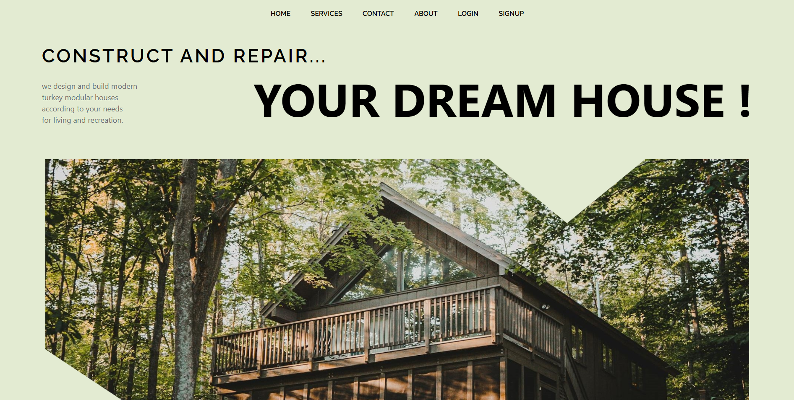
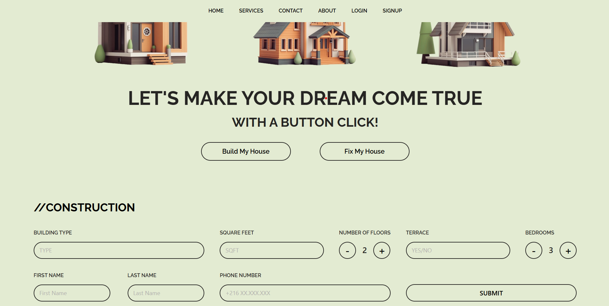

# 🏠 House-Sale  

A simple web project for showcasing houses available for sale, built with HTML5, CSS3, and JavaScript.  

---

## 🚀 Demo  
Here are some previews of the project:  

### Homepage  
  

### Services  
  

---

## 🛠️ Technologies Used  
- **HTML5**  
- **CSS3**  
- **JavaScript**  

---

## 📝 How to Clone the Project  
Follow these simple steps to run the project locally:  

1. Clone the repository:  
   ```bash
   git clone <https://github.com/selimboudaga/house_sale.git>
